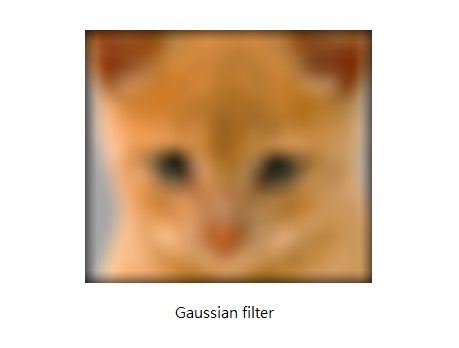
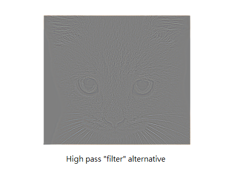

# 洪章瑋 <span style="color:red">(102062171)</span>

# Project 1 / Image Filtering and Hybrid Images

## Overview
This project's goal is to write an image filter processing function in Matlab to create hybrid images which combine two different images by applying low-frequency and high-frequency filters respectively. 


## Implementation
1. my_imfilter.m
	* Zero-Paddding
		- Use '**padarray**' to create a zero-padding matrix.
	* Avoid 'for loop'
		- Use '**im2col**' with '**sliding**' option to flatten each sub-matrix in sliding window to a column.
		- Multiply filter kernel to the matrix from the previous step
	```
	% rotate 180 degree
	h = flipud(fliplr(h));
	% flatten filter
	h_ = reshape(h, [1 size(h, 1) * size(h, 2)]);
	% padding 
	f_pad = padarray(f, [floor(size(h, 1)/2) floor(size(h, 2)/2)]);
	% flatten f
	for c = 1 : size(f, 3)
	    f_pad_(:,:,c) = im2col(f_pad(:,:,c), size(h), 'sliding');
	end
	% multiply
	for c = 1 : size(f, 3)
	    output(:,:,c) = single((h_) * single(f_pad_(:,:,c)));
	end
	output = reshape(output, size(f));
	```
2. proj1.m
	* Low-frequency image
		- Use '**Gaussian**' filter with '**my_imfilter**' to filter the original image.
	* High-frequency image
		- Subtract the low-frequency image from original image
	* Hybrid
		- Sum both low-frequency image and high-frequency image

	```
	low_frequencies = my_imfilter(image1, filter);
	high_frequencies = image2 - my_imfilter(image2, filter);
	hybrid_image = low_frequencies + high_frequencies;
	```

## Installation
- Run '**proj1_test_filtering**'
	- execute 'proj1_test_filtering' in '**code**' directory
- Run '**proj1**'
	- execute 'proj1' in '**code**' directory

### Results
### proj1_test_filtering
<table border=1>
<tr>
<td>




</td>
</tr>

<tr>
<td>


</td>
</tr>

</table>  

### Hybrid image
#### Cutoff frequency experiment
##### dog (low, cutoff = 3), cat (high, cutoff = 3)
<table border=1>
<tr>
<td>


</td>
</tr>
</table>

##### dog (low, cutoff = 5), cat (high, cutoff = 5)
<table border=1>
<tr>
<td>


</td>
</tr>
</table>

##### dog (low, cutoff = 7), cat (high, cutoff = 7)
<table border=1>
<tr>
<td>


</td>
</tr>
</table>

##### dog (low, cutoff = 9), cat (high, cutoff = 9)
<table border=1>
<tr>
<td>


</td>
</tr>
</table>

##### dog (low, cutoff = 11), cat (high, cutoff = 11)
<table border=1>
<tr>
<td>


</td>
</tr>
</table>
